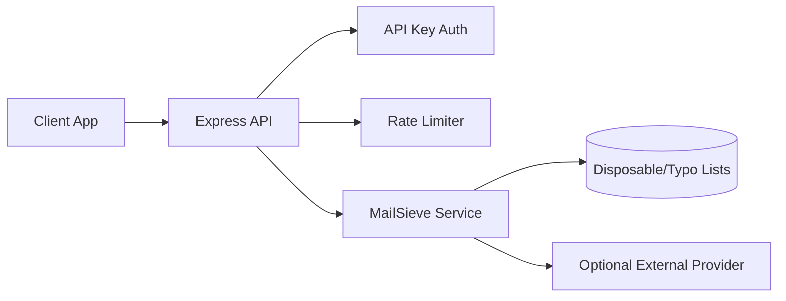

# MailSieve

[](https://github.com/SavioCodes/MailSieve/actions/workflows/ci.yml)
[](./LICENSE)
[](./openapi.yaml)

MailSieve is an HTTP API that classifies signup emails for disposable-domain and lightweight risk signals.

PT-BR: API para validacao de email com foco em sinal util, baixa latencia e operacao simples.

## Why This Exists

Fraud and disposable addresses can degrade signup funnels. MailSieve provides quick risk hints while keeping infrastructure lightweight.

## Architecture



## Core Endpoints

- `GET /v1/health`
- `POST /v1/generate`
- `POST /v1/batch`

Contract: [`openapi.yaml`](./openapi.yaml)

## Example Requests

```bash
curl -X POST http://localhost:3000/v1/generate \
  -H "Content-Type: application/json" \
  -H "x-api-key: <your-key>" \
  -d '{"email":"user@mailinator.com"}'
```

```bash
curl -X POST http://localhost:3000/v1/batch \
  -H "Content-Type: application/json" \
  -H "x-api-key: <your-key>" \
  -d '{"emails":["a@mailinator.com","b@gmail.com"],"concurrency":2}'
```

## Quickstart

```bash
npm install
cp .env.example .env
npm run dev
```

## Test and Quality Gates

```bash
npm run lint --if-present
npm test
npm run build
npm run verify
```

## Operational Signals

- Quality gates cover tests, build, and a separate `verify` path for deployment confidence.
- The API contract is tracked in `openapi.yaml`, with local Docker support for repeatable validation.
- The HTTP flow is easy to reproduce: health check, single email analysis, and batch analysis all run from documented commands.

```bash
npm test
npm run build
npm run verify
```

## Local Infra with Docker Compose

```bash
docker compose up --build
```

The compose setup includes a container healthcheck to ensure the API process is responsive.

## Technical Decisions and Trade-offs

- API key auth and in-process rate limiting keep setup simple for early-stage deployments.
- Optional provider integration is isolated so the API can run in offline mode.
- JSON/file-based runtime state is practical for small workloads, with migration path to external stores.

## Roadmap

- [ ] Add persistent rate-limit backend for multi-instance deployments
- [ ] Add performance tests for high-volume batch requests
- [ ] Add OpenAPI example responses for edge-case failures

## License

MIT. See [LICENSE](./LICENSE).
